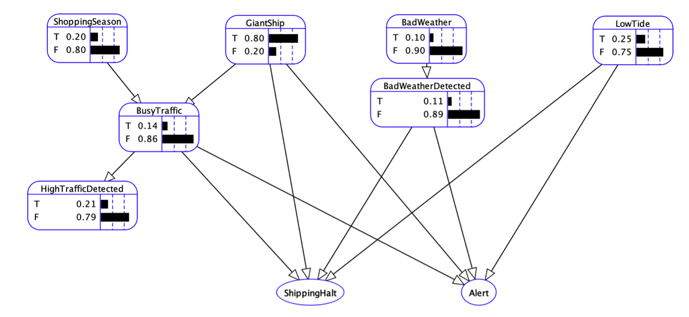

# Reasoning with Bayesian Networks

The aim was to create an alert system for the fictional [Mecynian Canal](https://wiki.opengeofiction.net/wiki/index.php/Mecyna#The_Canal), an artificial sea-level waterway, by using Bayesian networks to reason with uncertainty. Bayesian networks were modelled using [AISpace](http://aispace.org/). The implementation consists of a XML parser as well as an algorithm to merge two Bayesian networks that was adapted from [Feng et al. (2014)](https://www.sciencedirect.com/science/article/pii/S0031320313005232).



### Compiling and Running Instructions

Navigate into the src directory:

```shell script
cd src
```

Compile all `.java` files:

```shell script
javac *.java
```

To run the application, your command should take the following form:

```shell script
java Main <BN1> <BN2>
```

For example, pass:

```shell script
java Main example1 example2
```

Please note that the path to the `saved-models` directory as well as the .xml file extension is hard-coded can be omitted.

The output should be:

```

Net: example1
-
...


Net: example2
-
...


Net: Merger
-
Name: NoFuel
Parents: none
CPT:
[0.15, 0.85]
-
Name: RoadIcy
Parents:[InAlaska, Winter]
CPT:
[0.7777777777777777, 0.2222222222222222]
[0.4576271186440678, 0.5423728813559322]
[0.5602409638554217, 0.43975903614457834]
[0.2537878787878788, 0.7462121212121213]
-
...

```

Valid commands:

```shell script
java Main CANAL1 CANAL2mod
```
